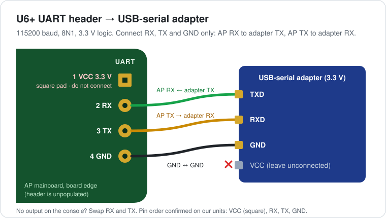
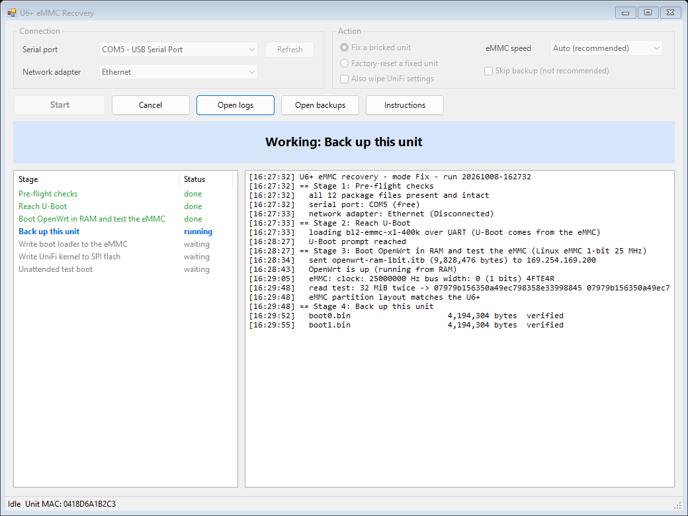
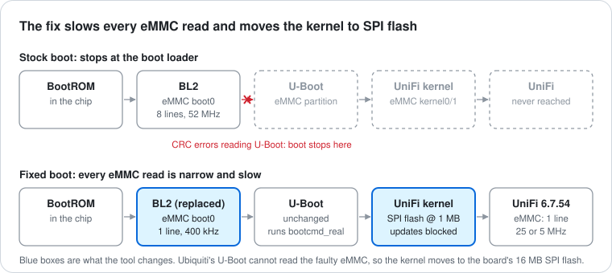

<p align="center">
  
</p>

<p align="center">
  
  
  
  
  
</p>

Your UniFi U6+ sits there blinking **white, blue, white, blue**, and the reset button does nothing.
It isn't dead. Its eMMC storage link has shit the bed: the chip still works, just not at the speed
Ubiquiti's boot code demands. This tool brings it back by making every stage of the boot use the eMMC
on **one data line, slowly**, and moving the UniFi kernel onto the board's SPI flash. (this is mostly a very dumb proof of concept, handled 90% by Sir Claudius

About 10 minutes per AP.

> [!WARNING]
> This is a **stopgap**, not a factory grade super sigma repair. A fixed AP is frozen on UniFi **6.7.54**, boots with
> Ubiquiti's image signature check turned off, and **must never receive a firmware update**. Claim a
> warranty replacement first. Use at your own risk; opening and modifying the AP will likely void its
> warranty, despite how illegal that is.

---

## Contents

- [Is your AP affected?](#is-your-ap-affected)
- [What you need](#what-you-need)
- [Wiring](#wiring)
- [Quick start](#quick-start)
- [What it does](#what-it-does)
- [After the fix](#after-the-fix)
- [Test status](#test-status)
- [Troubleshooting](#troubleshooting)
- [Why U6+ units fail](#why-u6-units-fail)
- [How it works](#how-it-works)
- [Repository layout](#repository-layout)
- [Credits and licenses](#credits-and-licenses)

## Is your AP affected?

| Check | Affected unit |
| --- | --- |
| Model | UniFi U6+ (UAPL6, MediaTek MT7981) |
| LED | Alternating white / blue (TFTP recovery), or stuck white. *Blinking blue alone just means it lost its controller.* |
| Reset button | No effect |
| Serial console (115200 8N1) | `MSDC: CRC error occured while reading data with cmd=17` then `BL2: Failed to load image id 3`, or U-Boot's `Card did not respond to voltage select!` |

## What you need

| | |
| --- | --- |
| 🔌 USB-serial adapter | 3.3 V logic (FT232, CP2102, CH340...). Its VCC pin stays **unconnected**. |
| 🧷 A way onto the UART pads | The header is unpopulated: solder a 4-pin header or wires, or hold pogo pins in place, i just literally let them sit in the hole on my desk smile |
| ⚡ PoE injector + Ethernet cable | Injector's LAN port cabled **straight to the laptop**: no switch, no router |
| 💻 Windows 10/11 laptop | Recovery tool uses built-in PowerShell and OpenSSH |
| 🐍 Python 3.8+ | Only once, to download and build the firmware images (`Prepare.bat`) |

## Wiring

<p align="center">
  
</p>

| Pad | Signal | Adapter |
| :---: | --- | --- |
| 1 ◼ square | VCC 3.3 V | **do not connect** |
| 2 | RX | TX |
| 3 | TX | RX |
| 4 | GND | GND |

The 4-pad row sits at the board edge, labelled **UART**. No output on the console? Swap RX and TX.

## Quick start

**1. Prepare the images (once per PC).** Double-click **`Prepare.bat`**. It downloads the official
UniFi 6.7.54 firmware (from Ubiquiti), the OpenWrt 25.12.5 U6+ recovery image (from OpenWrt) and
`mtk_uartboot` (from its GitHub release), checks each against a pinned SHA-256, and builds the patched
images locally. Nothing from Ubiquiti is stored in this repository.

```
1. Official downloads (checked against pinned SHA-256)
2. Extracting UniFi 6.7.54
3. Building the patched UniFi kernels
4. Building the OpenWrt RAM recovery systems
5. Writing images ... matches tested build
```

**2. Wire up.** Open the AP, connect RX / TX / GND as above, cable the PoE injector's LAN port to the
laptop. Leave the PoE **unplugged**.

**3. Fix.** Double-click **`U6Plus-Fixer.bat`**, choose **Fix a bricked unit**, press **Start**, and plug
in the PoE when the banner turns yellow. Then hands off until it turns green.

<p align="center">
  
</p>

Prefer a console? `Run-Fix.bat [-Mode Fix|Reset] [-FactoryReset] [-Speed auto|fast|slow]`.

## What it does

<p align="center">
  
</p>

| Stage | What happens | Writes? |
| --- | --- | :---: |
| 1. Pre-flight | Package integrity, serial port free, laptop **not** on a live LAN, disk space | – |
| 2. Reach U-Boot | Loads a 1-bit, 400 kHz BL2 over UART; falls back to sending U-Boot itself over UART | – |
| 3. Recovery system | Boots OpenWrt **in RAM**, reads the eMMC twice at 25 MHz; drops to 5 MHz if it isn't perfect | – |
| 4. Backup | Boot areas, partition table, config and all 16 MB of SPI flash to `backups\<MAC>-<time>\`, each SHA-256-checked | – |
| 5. eMMC | 1-bit BL2 into boot0 (repairs the U-Boot partition if needed), original kernel into kernel0 | ✅ verified |
| 6. SPI flash | Patched UniFi kernel at `0x100000`, U-Boot `bootcmd_real` set | ✅ verified |
| 7. Test boot | Resets and checks UniFi boots on its own with zero eMMC errors | – |

Every write is read back and compared, and the run stops at the first mismatch. Retries and fallbacks
are automatic: BootROM upload glitches, a missed U-Boot window, failed transfers, a PC that gets no IP
address, a chip that needs the slower speed (handled with a **software** reboot, so you still only plug
in once).

**Factory reset.** The reset button doesn't work on a fixed AP. Choose **Factory-reset a fixed unit** in
the GUI (or tick *Also wipe UniFi settings* during a fix): it backs up and wipes the UniFi config, and
the AP comes back ready to adopt.

## After the fix

- **Disconnect the serial adapter.** Stray noise can stop autoboot.
- **Adopt it** (or it reconnects with its old config).
- **Turn off automatic firmware updates** for the AP in your controller. Updates are blocked on the AP
  itself and should show as `FirmwareCheckFailed`; a stock update would rewrite the boot loader and brick
  it again, so this is a just in case measure.
- Factory reset = "Forget" in the controller, or the tool's reset mode. or SSH. Pick your poison, if you dare.

## Test status

Tested on two failed U6+ units (Kingston and Samsung eMMC):

| Scenario | Status |
| --- | --- |
| Fix a never-touched dead unit, one power-on | ✅ |
| Re-run on an already fixed unit | ✅ |
| Factory reset mode | ✅ settings wiped, unit boots defaults |
| Speed fallback to 5 MHz via software reboot (no power cycle) | ✅ |
| Unattended boot and adoption into a controller | ✅ |
| Update block: UniFi's own upgrade routine run on the AP | ✅ refused, no reboot, boot loader unchanged |
| `Prepare.bat` rebuilds byte-identical images | ✅ |
| Update pushed from a controller with a real firmware image | ⚠️ not yet tried |
| FIP repair over UART, serial-console IP fallback | ⚠️ never needed on our units |

## Troubleshooting

| Message | Fix |
| --- | --- |
| *images have not been prepared* | Run `Prepare.bat` (needs Python 3 and internet) |
| *Serial port ... does not exist / is in use* | Pick the right COM port; close PuTTY or any serial terminal |
| *connected to a network* | The Ethernet cable runs to a LAN. Cable the injector straight to the laptop or device: the recovery system runs a DHCP server |
| *No response from the AP* | Check wiring, swap RX/TX, make sure the AP was unpowered at Start |
| *not reliable even at 5 MHz* / *boot loader could not read the eMMC on its own* | This unit's eMMC link is too far gone for this method, in other words, ya cooked. |
| *Unexpected eMMC partition layout* | Not a stock U6+ layout. Nothing was written |
| Anything else | Open an issue with the `runs\<time>\` folder (`fix.log`, `console.log`) |

## Why U6+ units fail

We examined two failed units in detail:

| | Unit 1 | Unit 2 |
| --- | --- | --- |
| eMMC | Kingston MK2704 | Samsung 4FTE4R (made Jan 2024) |
| Wear | Past rated life (`0x0b`) | 10–20% (`0x02`) |
| Stock boot (8 lines, up to 52 MHz) | ❌ CRC errors | ❌ CRC errors |
| 1 line at 25 MHz (Linux) | ✅ | ✅ |
| 1 line at 400 kHz (boot loader) | ✅ | ✅ |

Two vendors, very different wear, identical failure: the storage chips aren't the common cause. The
fault looks like a marginal electrical link on the board side (signal integrity or the chip's power),
which a narrower, slower bus tolerates. UniFi firmware updates rewrite the boot loader area, which is
why units so often seem to die right after an update. This is our reading of the evidence, not a
confirmed root cause.

## How it works

<details>
<summary><b>The boot chain, and what changes</b></summary>

- **BootROM** (in the SoC) loads **BL2** from eMMC `boot0`. Stock BL2 reads the eMMC 8-bit at speed and
  fails. We replace it with a Trusted Firmware-A BL2 built for **1-bit at 400 kHz**.
- **BL2** loads the FIP (BL31 + Ubiquiti U-Boot) from the GPT partition `u-boot`.
- **U-Boot** cannot read the faulty eMMC at all (its driver rejects the card), but it reads the 16 MB
  **SPI NOR** fine. Its `bootcmd_real` (the same hook OpenWrt's official installer uses) now does
  `sf read 0x46000000 0x100000 <size>; fdt rm /signature; bootm`.
- The **UniFi kernel** FIT carries the whole UniFi root filesystem as an initramfs. `prepare.py` patches
  its device tree (`bus-width = <1>`, `max-frequency` 25 MHz or 5 MHz, no high-speed modes) and its
  initramfs (`/sbin/fwupdate` refuses, `fwupdate.real` points at it, and `ubntbox` can no longer find
  `mmcblk0boot0`), then fixes the FIT hashes. RSA signatures are left in place and ignored once
  `/signature` is removed from U-Boot's control DT.
- The **recovery system** is OpenWrt 25.12.5's own U6+ initramfs with the same 1-bit patch and the whole
  SPI NOR exposed read-only for backup.
- Files reach U-Boot with its `tftpsrv` (the laptop pushes). Windows Firewall only allows the reply from
  U-Boot's random source port because the tool first sends one packet to every port in 1024–4095.

</details>

<details>
<summary><b>Things we learned the hard way</b></summary>

- Some chips pass Linux at 25 MHz but miss BL2's **100 ms** busy timeout after the partition switch. So
  the boot loader always runs at 400 kHz.
- 400 kHz is too slow for **Linux**: its 128 KB reads hit the MMC driver's 5 s timeout. Linux gets 5 MHz
  instead.
- The MT7981 BootROM listens for UART download after a **software** reset too, so switching speed never
  needs a power cycle.
- `mtk_uartboot` gives up before a 400 kHz BL2 has loaded U-Boot (~15 s): take over the port as soon as
  BL2 reports `Located partition 'u-boot'`.
- UniFi's console only prints its login prompt after you press Enter. This caused way too many issues it is hilarious. The program helps avoid this.

</details>

## Repository layout

```
Prepare.bat              download + build the images (once per PC)
U6Plus-Fixer.bat         GUI
Run-Fix.bat              console
Fix-U6Plus.ps1           recovery engine
U6Plus-Fixer.ps1         GUI (WinForms)
prepare/prepare.py       downloader / image builder (standard library only)
prepare/u6lib/           device-tree and cpio helpers
firmware/bl2/            1-bit BL2 boot loaders (BSD-3-Clause) + provenance
docs/img/                diagrams
images/  bin/            built by Prepare.bat (git-ignored, never commit)
runs/  backups/          per-run logs and per-unit backups (git-ignored)
```

## Credits and licenses

- **BL2**: [Trusted Firmware-A](https://www.trustedfirmware.org/) (MediaTek fork) with
  [sam-413's U6+ workaround](https://github.com/sam-413/Bricked-U6Plus-eMMC-Workaround) (drive strength,
  pull-ups) plus a 1-bit eMMC change. BSD-3-Clause.
- **[mtk_uartboot](https://github.com/981213/mtk_uartboot)** by 981213. AGPL-3.0, downloaded from its
  official release.
- **[OpenWrt](https://openwrt.org/)** 25.12.5 U6+ image. GPL-2.0, downloaded from OpenWrt.
- The [OpenWrt forum](https://forum.openwrt.org/t/how-to-unbrick-unifi6-plus-ap-through-usb-to-serial-ttl/233103)
  community for the U6+ serial notes.
- Our scripts: [MIT](LICENSE). Full notices: [THIRD_PARTY_NOTICES.md](THIRD_PARTY_NOTICES.md).

Not affiliated with or endorsed by Ubiquiti Inc. UniFi is a trademark of Ubiquiti Inc. The images
`Prepare.bat` builds contain Ubiquiti firmware for use on your own hardware: don't redistribute them.
